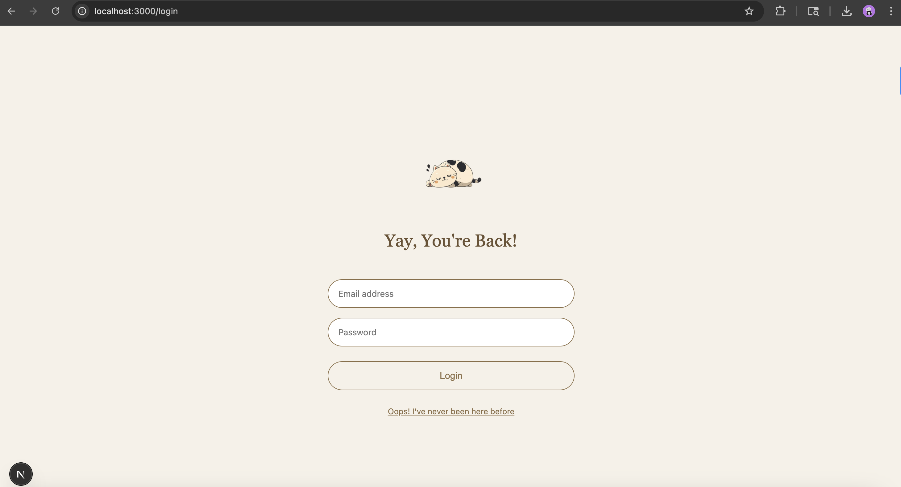
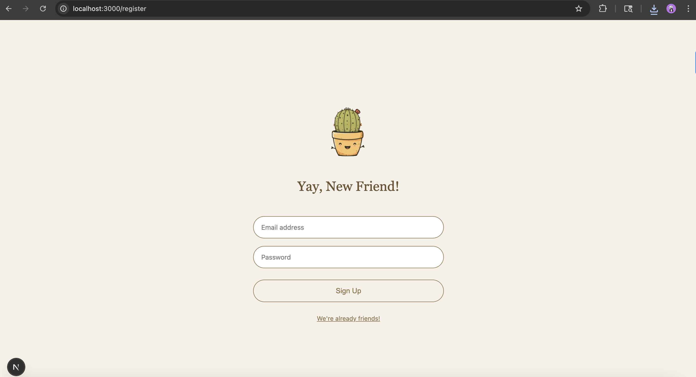
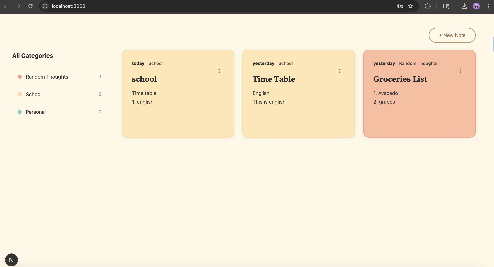
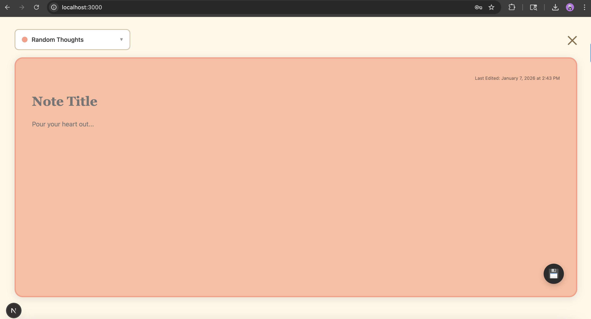

# Notes App

A full-stack note-taking application built with **Django** (backend) and **Next.js** (frontend) that allows users to create, update, and delete notes with categories. This project features user authentication, a RESTful API, and a responsive UI.


---

## App Screenshots

### Login Page:


### Registration Page:


### Main Page:


### Single Note Page:


---

## Table of Contents

1. [Features](#features)
2. [Technologies](#technologies)
3. [Prerequisites](#prerequisites)
4. [Setup Instructions](#setup-instructions)
5. [Running the Project](#running-the-project)
6. [Folder Structure](#folder-structure)
7. [Development Process](#development-process)
8. [Key Design & Technical Decisions](#key-design--technical-decisions)
9. [Testing Strategy](#testing-strategy)
10. [AI Tools Usage](#ai-tools-usage)


---

## Features

* ✅ User registration and login
* ✅ Add, edit, and delete notes
* ✅ Categorize notes (Random Thoughts, School, Personal)
* ✅ Filter notes by category
* ✅ Responsive frontend with Next.js
* ✅ RESTful API with Django REST Framework
* ✅ CSRF protection for secure form submissions

---

## Technologies

**Backend:**
* Django 4.x
* Django REST Framework
* SQLite (default) / PostgreSQL support

**Frontend:**
* Next.js 14
* React 18
* Tailwind CSS
* Fetch API for HTTP requests

**Authentication:**
* Django's built-in session authentication
* CSRF token handling

---

## Prerequisites

* Python 3.10+
* Node.js 18+ and npm
* Git

---

## Setup Instructions

### 1. Clone the repository

```bash
git clone https://github.com/yarrap/Notes_app.git
cd Notes_app
```

---

### 2. Setup Backend (Django)

#### a) Create a Python virtual environment

**Important:** Make sure you're in the `Notes_app` root directory.

```bash
python3 -m venv env
```

#### b) Activate the virtual environment

**Mac/Linux:**
```bash
source env/bin/activate
```

**Windows:**
```bash
env\Scripts\activate
```

You should see `(env)` appear at the beginning of your terminal prompt.

#### c) Install dependencies

```bash
pip install -r backend/requirements.txt
```

#### d) Navigate to backend and apply migrations

```bash
cd backend
python manage.py makemigrations
python manage.py migrate
```

#### e) (Optional) Create a superuser

```bash
python manage.py createsuperuser
```

#### f) Start Django server

```bash
python manage.py runserver
```

Backend will run at `http://localhost:8000/`.

**To stop the server:** Press `Ctrl+C`

---

### 3. Setup Frontend (Next.js)

Navigate to the frontend directory:

```bash
cd frontend/notes-frontend
```

Install dependencies:

```bash
npm install
```

Start the development server:

```bash
npm run dev
```

Frontend will run at `http://localhost:3000/`.

---

## Running the Project

**Note:** You'll need two separate terminal windows/tabs - one for backend, one for frontend.

### Terminal 1 - Backend

1. Navigate to the project root:
```bash
cd Notes_app
```

2. Activate virtual environment:
```bash
source env/bin/activate  # Mac/Linux
# or
env\Scripts\activate     # Windows
```

3. Start backend server:
```bash
cd backend
python manage.py runserver
```

Backend runs at `http://localhost:8000/`

---

### Terminal 2 - Frontend

1. Navigate to the frontend directory:
```bash
cd Notes_app/frontend/notes-frontend
```

2. Start frontend server:
```bash
npm run dev
```

Frontend runs at `http://localhost:3000/`

---

3. **Open your browser** at `http://localhost:3000`

---

## Folder Structure

```
Notes_app/
│
├── backend/
│   ├── notes_app/                 # Main Django app
│   │   ├── migrations/            # Database migrations
│   │   ├── models.py              # Data models (User, Note, Category)
│   │   ├── serializers.py         # DRF serializers for API
│   │   ├── views.py               # API endpoints and business logic
│   │   ├── urls.py                # App-level URL routing
│   │   └── tests.py               # Unit tests
│   │
│   ├── notes_app_project/         # Django project configuration
│   │   ├── settings.py            # Project settings and config
│   │   ├── urls.py                # Root URL configuration
│   │   └── wsgi.py                # WSGI application entry point
│   │
│   ├── requirements.txt           # Python dependencies
│   └── manage.py                  # Django CLI
│
├── frontend/
│   └── notes-frontend/            # Next.js application
│       ├── pages/                 # Next.js pages (routing)
│       │   ├── index.js           # Main notes page
│       │   ├── login.js           # Login page
│       │   └── register.js        # Registration page
│       ├── components/            # React components
│       │   ├── NoteCard.js        # Individual note display
│       │   ├── NoteForm.js        # Note creation/editing form
│       │   └── CategoryFilter.js  # Category filtering UI
│       ├── styles/                # CSS and Tailwind styles
│       └── package.json           # Node.js dependencies
│
└── pictures/                      # Screenshots for documentation
```

---

## Development Process

### Phase 1: Backend Setup
**Goal:** Create a robust API foundation

1. **Database Design**
   - Designed models for Users, Notes, and Categories
   - Established relationships (one-to-many between users and notes)
   - Set up SQLite for development with PostgreSQL migration path

2. **API Development**
   - Built RESTful endpoints following standard conventions
   - Implemented serializers for data validation and transformation
   - Added authentication views (register, login, logout)

3. **Testing**
   - Tested the API to verify endpoints work correctly
   

---

### Phase 2: Frontend Development
**Goal:** Build an intuitive, responsive UI matching the Figma design

1. **Component Architecture**
   - Built React components for the UI
   - Implemented routing with Next.js pages

2. **API Integration**
   - Connected frontend to backend
   - Implemented authentication flow

3. **UI/UX Polish**
   - Created responsive design

---

## Key Design & Technical Decisions

### Backend

- Used Django REST Framework as required for the project
- SQLite database for development
- RESTful API endpoints for notes operations
- User authentication with CSRF protection

### Frontend

- Next.js for the frontend framework
- Category-based organization (Random Thoughts, School, Personal)
- Filter functionality to view notes by category

### Integration

- Fetch API to connect frontend with Django backend
- CSRF token handling for secure requests

---

---

## Testing Strategy

This project includes a comprehensive backend test suite built using **Django TestCase** and **Django REST Framework’s APITestCase** to ensure correctness, reliability, and maintainability of the application.

### Test Coverage Overview

The test suite focuses on validating real-world usage scenarios and enforcing strict data integrity:

- **Model Tests**
  - Note creation with required and default fields
  - Category validation and choices
  - User–note relationship integrity
  - String representation (`__str__`)
  - Automatic timestamp handling (`created_at`, `modified_at`)
  - Update and deletion behavior
  - Ordering guarantees

- **Authentication Tests**
  - User registration
  - Successful login
  - Authentication failure for invalid credentials

- **Permissions & Data Isolation**
  - Ensures users can only access their own notes
  - Verifies complete isolation between users’ data

- **Filtering Logic**
  - Category-based filtering (personal, school, random, drama)

- **API-Level Validation**
  - Authenticated API access using DRF test utilities
  - Verification of user-scoped note access

### Running Tests

```bash
python manage.py test
```

---

## AI Tools Usage

I used AI assistants (Claude and ChatGPT) strategically throughout development while maintaining full control over architectural decisions and core implementation.

### Backend Development (20% AI-assisted)

**What I wrote myself:**
- All core business logic and model design
- API endpoint structure and serializers
- Authentication flow implementation
- Database schema and relationships

**How AI helped:**
- **Code review and optimization:** Asked Claude to review my serializer code and suggest improvements. It recommended using `read_only_fields` instead of manually excluding fields, which cleaned up my code.
- **Django best practices:** Used ChatGPT to verify my approach to setting up CORS and CSRF configuration. It suggested using `django-cors-headers` package which I hadn't considered.
- **Documentation:** Asked AI to suggest docstring formats for my views, which I adapted to match my style.

---

### Frontend Development (60% AI-assisted)

**What I wrote myself:**
- Overall component structure and page layouts
- Authentication logic and routing
- API integration and error handling

**How AI helped:**
- **UI implementation from Figma:** Showed Claude screenshots of the Figma design and asked for Next.js component structure suggestions. I then manually adapted these to match the exact design specifications.
- **Fetch API patterns:** Used Claude to suggest best practices for handling async API calls and error states, which I refined based on my specific needs.

**Specific example:**
I asked Claude: "How should I structure a note card component with title, content, category badge, and action buttons?"
